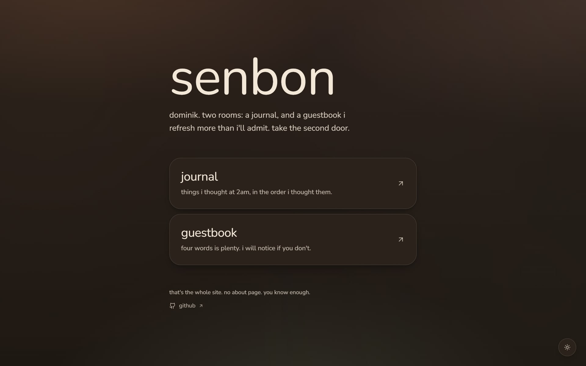

<div align="center">

# 千本 · Senbon

### A quiet personal journal. The story remains untold.

A quiet personal **journal**: markdown entries, a warm ambient background, and an unhurried reading experience.

[](https://github.com/dominikkoenitzer/Senbon/actions/workflows/ci.yml)
[](https://senbon.ch)




</div>

---

> [!NOTE]
> Senbon is **deliberately un-indexed**. Crawlers are allowed to *fetch* the site
> precisely so they can see its `noindex` directives; a blanket `disallow` would
> leave search engines indexing the bare URL from external links. AI crawlers are
> blocked outright. There is no OG or SEO metadata anywhere. It's a private site
> that happens to be open source.

## Contents

- [About](#about)
- [Features](#features)
- [Tech stack](#tech-stack)
- [Getting started](#getting-started)
- [Scripts](#scripts)
- [Writing a journal entry](#writing-a-journal-entry)
- [Project structure](#project-structure)
- [Guestbook](#guestbook)
- [Design notes](#design-notes)
- [Privacy](#privacy)
- [Deployment](#deployment)
- [Author](#author)

## About

Senbon (千本, "one thousand") is a personal journal: a place to publish
long-form entries, newest first. The name is an aspiration, not an entry count.
It leans into atmosphere, with warm pigment colours, editorial typography and
unhurried motion, while staying fast and accessible.

Entries are plain markdown files committed to this repo. There is no CMS, no
third-party tracking, and no comment system.

Much of the work here has been **subtraction**. A command palette, full-text
search, tag filters, load-more pagination, a featured strip, prev/next links, a
table of contents, reading-time estimates and a canvas particle background were
all built and then deliberately removed. Three routes do not need a launcher, and
a few hundred words do not need a progress bar. What remains is what earns its
place.

## Features

- **Journal.** Markdown entries with frontmatter, newest first, relative dates
  ("3 weeks ago") with the absolute date on hover.
- **Guestbook.** Visitors sign a wall at `/guestbook`. Rate-limited,
  honeypot-protected, with moderation behind a password gate.
- **Reading polish.** Copy buttons on code blocks, external-link markers,
  heading anchors, a skip-to-content link, themed 404 and error boundaries.
- **Atmosphere.** One warm ambient background built from three CSS layers, with
  no SVG and no canvas. `prefers-reduced-motion` is respected throughout.

## Tech stack

- **[Next.js 16](https://nextjs.org/)** with the App Router, Turbopack and React Server Components
- **[React 19](https://react.dev/)** + **[TypeScript 5](https://www.typescriptlang.org/)**
- **[Tailwind CSS 4](https://tailwindcss.com/)**, configured entirely in `globals.css`
  via `@theme inline`; there is no JS config file
- **[Lenis](https://lenis.darkroom.engineering/)** for gentle smooth scrolling, skipped
  under reduced motion
- **[react-markdown](https://github.com/remarkjs/react-markdown)** + `remark-gfm` +
  `rehype-highlight` for entry rendering
- An external guestbook API
- **[Vercel](https://vercel.com/)** hosting + first-party `@vercel/analytics`

No Framer Motion, no shadcn/ui, no Radix. Entrance animation is a CSS class, and
the nine unused shadcn primitives were removed along with their Radix
dependencies.

Package manager: **Bun**. Please don't introduce an `npm`/`yarn`/`pnpm` lockfile;
Vercel installs with `--frozen-lockfile` and a competing lockfile breaks the build.

## Getting started

**Prerequisites:** [Bun](https://bun.sh/); the version is pinned in `.bun-version`.

```bash
git clone https://github.com/dominikkoenitzer/Senbon.git
cd Senbon

bun install
bun run dev          # → http://localhost:1000
```

No configuration is needed to run the journal locally; entries are read from
`content/journal/`. The guestbook degrades to an "offline" notice unless its
environment variables are set. See [`env.example`](env.example).

## Scripts

| Command | Description |
|---|---|
| `bun run dev` | Dev server on [localhost:1000](http://localhost:1000) |
| `bun run build` | Production build |
| `bun run start` | Serve the production build |
| `bun run lint` | Run ESLint |

## Writing a journal entry

Create `content/journal/<slug>.md`:

```yaml
---
title: "Entry Title"
excerpt: "One-line summary that appears on the index card."
publishedAt: "2026-05-26"
tags:
  - design
  - performance
---
```

Those four keys are the entire schema. The slug is the filename without its
extension, posts sort newest-first, and heading anchors are generated from H2–H4.
The site rebuilds on commit.

## Project structure

```
content/journal/          # Markdown entries (frontmatter + body)

src/
├── app/                  # App Router: home, journal, guestbook, admin, robots
├── components/
│   ├── blog/markdown/    # ReactMarkdown component overrides
│   ├── chrome/           # Back-to-top, smooth scroll
│   └── guestbook/        # Sign form, wall, moderation UI
├── constants/            # Blog and guestbook config
├── lib/                  # Post loading, guestbook clients, utils
└── types/                # JournalPost, GuestbookEntry and friends
```

## Guestbook

Signing is backed by an **external API**,
rather than a managed service that can lapse.
The previous guestbook died exactly that way.


It defends itself with a honeypot, per-IP rate limiting that fails closed, a link
filter, invisible-character stripping, and optional moderation. Visitor IPs are
never stored raw; they are HMAC-hashed before they reach the database.


## Design notes

The palette is warm: terracotta, honey, dusty rose and sage, on cream. Shadows
are brown, because black shadows on cream read as grime. Headlines are Fraunces;
everything else is Nunito. There are no uppercase wide-tracked micro-labels, and
no metallic gold: both made it feel like a luxury watch advert rather than a
quiet journal.

Body copy never drops below `text-foreground/70`, which is the contrast floor on
the cream background. Hierarchy comes from size and weight instead.

## Privacy

- Search engines may crawl so that `noindex` is actually seen; AI crawlers
  (GPTBot, ClaudeBot, Google-Extended, PerplexityBot, CCBot, Bytespider and
  others) are disallowed.
- `X-Robots-Tag: noindex, nofollow, noarchive, nosnippet, noimageindex, noai, noimageai`
  on every response, plus root metadata and redundant meta tags.
- No OG images, sitemap, or structured data.
- The only telemetry is first-party Vercel Analytics.

## Deployment

Deploys to **[Vercel](https://vercel.com/)** from `main` via the Git
integration, live at **[senbon.ch](https://senbon.ch)**.

- [`ci.yml`](.github/workflows/ci.yml) lints and builds on every push and PR.

[Dependabot](.github/dependabot.yml) keeps dependencies and Actions current.

## Author

**dominikkoenitzer**, software engineer in Zürich, Switzerland.

[dk.punds.ch](https://dk.punds.ch) · [CV](https://dk.punds.ch/cv) · [@dominikkoenitzer](https://github.com/dominikkoenitzer) · [dominikkoenitzer@users.noreply.github.com](mailto:dominikkoenitzer@users.noreply.github.com)
